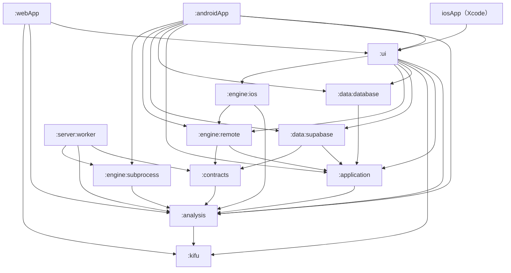

# 将棋サプリ アーキテクチャ設計

前提: KMP・端末内解析・GPLv3。

## 1. モジュール構成（Kotlin Multiplatform）

矢印は依存の向きで、循環はない。



`:ui` が具体実装（`:data:*` / `:engine:*`）へ依存しているのはiOSのソースセットだけ。
commonMainのViewModelは `:application` のportと `:analysis` しか見ない。iOSは
`ui/iosMain` が composition root を兼ねているため、そこだけ実装を組み立てる。

```
app/
├── kifu/                # 盤面・合法手・SFEN（board/）とKIFパース（kifu/）。依存の最下層
│   └── ターゲット: android/jvm/iosArm64/iosSimulatorArm64/js/wasmJs
├── analysis/            # 解析domainとアプリケーション共通ロジック（:kifu に依存）
│   ├── engine/          #  Engine・StudyEngine interface（USIブリッジの抽象化）・
│   │                    #  AnalysisRunner（局面並列の解析実行）・解析条件の不変条件
│   ├── blunder/ classify/ judge/ strength/ pipeline/ pv/  # 悪手定義・分類・相応判定・
│   │                    #  強さ推定・2パスのReportPipeline・読み筋延長
│   ├── notation/ rating/ #  連盟式棋譜表記・段級位
│   ├── drill/           #  次の一手の正誤判定（DrillJudge）・周回（DrillRotation）
│   ├── db/              #  保存レコード型（GameRecord・BlunderRecord ほか）
│   ├── policy/          #  強制アップデートの判定（AppPolicyRow・ForceUpdateJudge）
│   ├── text/            #  AppStrings＝ユーザー向け文言の一元管理（文言修正はここだけ）
│   ├── crash/           #  CrashReporter interface（NoopCrashReporter既定）
│   └── util/            #  Logger・Time（expect/actual）・SHA-256
├── application/         # portとuse case。具体実装は持たない
│   ├── db/ auth/ policy/ crypto/  # Repository・認証・強制アップデート・引き継ぎ登録のport
│   ├── upload/ download/ transfer/ consent/  # UploadOrchestrator・GameDeleter・
│   │                    #  GameDownloadService・TransferRestoreService・ConsentOrchestrator
│   ├── kifu/            #  GameImporter・GameImportFlow（取り込みと行き先の判断）
│   ├── engine/          #  AnalysisOrchestrator（取込→解析→保存）・失敗の種類と文言
│   └── ターゲット: android/jvm/iosArm64/iosSimulatorArm64/wasmJs
├── contracts/           # Workerとクライアントで共有する通信DTO（api/analysis・api/transfer）
│                        #  とワイヤ形式↔domainの相互変換
├── data/database/       # SQLDelight実装＋sqldelight/ にスキーマ（.sq）とmigration（N.sqm）。
│                        #  iosMainにDatabaseFactory
├── data/supabase/       # Supabase実装（認証・アップロード・ダウンロード・ポリシー取得）と
│                        #  引き継ぎコードの鍵・暗号（crypto/）
├── engine/remote/       # サーバー解析（RemoteAnalysisRunner）・失敗時のフェイルオーバー・
│                        #  検討ページ資産のポリシー（Kento*）
├── engine/ios/          # iOSのプロセス内エンジン（UsiEngineInProcess・IosEngineHost）と
│                        #  WKWebView内WASMのブリッジ。cinteropとenginelessフレーバーもここ
├── engine/subprocess/   # 別プロセスexecでUSIを話すエンジン実装（UsiEngineSubprocess）。
│                        #  ターゲットはjvm（Worker）とandroid（アプリ）
├── ui/                  # Compose Multiplatform UIとKMP ViewModel
│   ├── commonMain       #  画面（home/report/drill/gamelist/settings/account ほか）と
│   │                    #  ViewModel。theme/ がDESIGN.mdトークンの実装
│   ├── iosMain          #  IosMainController・MainViewController（iOSのcomposition root）と
│   │                    #  SharedUi framework（Swiftが触る型を持つモジュールをexport）
│   └── ターゲット: android/iosArm64/iosSimulatorArm64/wasmJs
├── androidApp/          # Androidアプリ本体（composition root）
│   ├── engine/ service/ #  UsiEngineProcess・解析のForeground Service
│   ├── db/ crash/       #  ドライバ生成・SentryCrashReporter
│   └── *Host.kt         #  :ui の画面へViewModelを配線するホスト
├── webApp/              # 「棋譜を検討する」ページのwasmJsアプリ（:ui / :analysis / :kifu）
├── server/worker/       # Ktorの解析ワーカー（:contracts / :analysis / :engine:subprocess に依存。
│                        #  クライアント用のDB・Supabase・暗号には依存しない）
└── iosApp/              # Xcodeプロジェクト（xcodegen・project.yml）。SharedUi frameworkを
                         # 読み込む。エンジン本体は engine/build_ios.sh が静的ライブラリを
                         # ビルドし、cinterop経由で :engine:ios にリンクされる
```

## 2. composition rootと依存規則

具体実装の組み立ては次の場所だけで行う。

| プラットフォーム | composition root |
| --- | --- |
| Android | `androidApp/ShogiApp.kt`・`MainActivity.kt`・`ui/MainViewModel.kt`・各`*Host.kt` |
| iOS | `ui/iosMain/MainViewController.kt`・`IosMainController.kt`（Supabase系は`SupabaseServices`） |
| Web | `webApp/wasmJsMain/main.kt`・`KentoViewModel.kt` |
| Worker | `server/worker/Application.kt`・`Routes.kt` |

守る規則（`./gradlew checkModuleBoundaries` が機械的に検査する。1〜3・5はGradleの
project依存から、4はGradle自体が落とす）:

1. `:ui` commonMain のViewModelはSupabase・SQLDelight・Android・UIKitの具体型を参照しない。
   受け取るのは `:application` のportと関数だけ
2. `:application` から `:data:*` や `:engine:*` の具体実装へ依存しない。
   逆向き（実装がportを実装する）だけを許す
3. Workerはクライアント用インフラ（DB・Supabase・暗号）へ依存しない
4. Gradleのproject依存に循環を作らない
5. `api(project(...))` による再公開は増やさない。使うモジュールへ直接依存する
6. ユーザー向け文言は `analysis/text/AppStrings.kt` 以外に直書きしない
7. モジュールをまたぐ移動で、SQLDelightスキーマ・Supabaseスキーマ・API wire format・
   エンジン解析条件は変えない（順に `verifyMigrations`・`infra/supabase/tests` のpgTAP・
   `:contracts` の `WireFormatTest`・`:analysis` の `EngineInvariantsTest` が検査する）

### 置き場所の決めごと

- `:contracts` はワイヤ形式↔domainの相互変換を持つため `:analysis` に依存する。
  変換を持たせないと、サーバーとクライアントが同じ変換を二重に持つことになる
- 別プロセスexecのエンジン実装はjvm（Worker）とandroid（アプリ）で同一のため、
  `:engine:jvm` と `:engine:android` に分けず `:engine:subprocess` 1つにする
- `RemoteAnalysisException`（サーバー解析の失敗の種類）は投げる側ではなく
  `:application` に置く。失敗をどう扱うかを決めるのはuse case側のため

### Android/iOSで共通のもの・ホストに残すもの

同じ調停を両プラットフォームに書くと、片側だけ直して挙動がずれる。共通化できるものは
commonMainのcontrollerか `:application` のuse caseに置く。

| 調停 | 置き場所 |
| --- | --- |
| 表示設定（テーマ・形勢表示・先後確認の省略）の保持と保存 | `ui/common/AppSettingsController` |
| 棋譜削除（サーバー削除の成否でローカル削除を止める） | `application/upload/GameDeleter` |
| 取り込み後の行き先（新規なら解析・既存ならレポート） | `application/kifu/GameImportFlow` |
| 解析後の自動アップロード・成績の同期 | `application/upload/UploadOrchestrator` |
| 一括アップロードの結果メッセージ | `application/upload/resultMessage` |
| ホーム・レポート・次の一手・アカウントの画面状態 | `:ui` のViewModel |

ホストに残すのはプラットフォーム固有の部分だけ。

- Android: Foreground Service上での解析、通知、`Uri`からのKIF読み出し、画面遷移の状態機械
- iOS: プロセス内エンジンでの解析、フォアグラウンド復帰時の再開、`UIPasteboard`、
  `PendingAnalysisStore` による中断復帰
- どちらもエンジン生成とHTTPクライアントの供給はホストが行う

## 3. エンジン統合

`Engine` interface（`analysis/commonMain/engine/Engine.kt`）がUSIブリッジを抽象化し、
`analyze`/`analyzeSfen`/`quit`/`newGame` の4操作のみを公開する。実装はプラットフォームごとに
起動方式が異なる。

### Android: 別プロセスexec

- **Android 10+ はアプリのデータ領域から実行ファイルをexecできない（W^X制約）**ため、
  エンジンバイナリは `jniLibs/arm64-v8a/libyaneuraou_usi.so` という名前でAPKに同梱し、
  `applicationInfo.nativeLibraryDir` から**別プロセスとしてexec**する（`UsiEngineProcess`）
- 評価関数nn.bin（Háo）はAPK同梱（assets圧縮）→初回起動時にfilesDirへ展開→EvalDirで指定
- 局面並列は「1局面Threads=1」を守った上でのマルチプロセス並列（既定4ワーカー・
  USI_Hash=128MB/プロセス）。フォアグラウンドサービス上で実行する（バックグラウンドだと
  スケジューラの都合でCPUのbigコアに載らず著しく遅くなるため）
- exec方式を選ぶ理由: (1) やねうら王はmain()起動・グローバル状態前提でライブラリ化は大改造、
  (2) 物差し条件が「1局面Threads=1」なので並列は局面並列＝マルチプロセスが唯一素直、
  (3) ネイティブクラッシュの隔離、(4) USI経路が揃うためゴールデンテストが可能。
  前例: DroidFishはStockfishを別プロセスexecで運用している

### iOS: プロセス内エンジン（in-process）

- **iOSはプロセスexec不可**のため、YaneuraOuを静的ライブラリ（`libyaneuraou.a`。
  `app/iosApp/engine/build_ios.sh` がビルド）としてリンクし、専用スレッド内でUSIプロトコルを
  話す（`UsiEngineInProcess`、cinterop経由でC wrapperを呼ぶ）
- エンジンスレッドは C wrapper 側の設計で `std::thread(...).detach()` されており、
  Kotlin/Swift側から明示的に終了させる手段がない。`quit()` は "quit" コマンドの送信のみで、
  一度 `quit` するとプロセスの再起動なしにはエンジンを再作成できない。そのため iOS 側は
  **1インスタンスをプロセス生存中ずっと使い回す**（`IosEngineHost` が保持し、局の区切りは
  `Engine.newGame()` で行う）
- `shogi_engine_start()` 呼び出し後はプロセスのfd0/fd1がエンジン用パイプに専有されるため、
  アプリ側のログはOSLog/NSLog等を使い、println/print を使ってはならない
  （`analysis/iosMain/util/Logger.ios.kt` 参照）
- in-processは1インスタンス＝局面並列不可のため、iOSの解析は直列（`workers=1` が既定運用）

### 共通の不変条件

- ノード数（既定400,000固定）・Threads=1・MultiPV=2・FV_SCALE=20（Háo）は両実装で共通。
  これらと評価関数のSHA-256・悪手定義バージョン・係数表バージョンを**解析結果レコードに記録**し、
  係数表と解析条件の不一致を検出したら再解析を促す
- `AnalysisOrchestrator`（`application/commonMain/engine`）が「KIFパース→エンジン解析→悪手判定→
  強さ推定→DB保存」を共通化し、Android（`AnalysisService`経由）・iOS
  （クリップボード/ファイル取込フロー）の両方から呼ばれる。プラットフォーム差は
  `engineFactory`/`disposeEngine`の注入だけに閉じ込めている
- エンジン解析には探索の揺れがある（ワーカー割当→置換表状態）。分類境界局面のビット一致
  assertは書かない

## 4. `:ui` の KMP ViewModel

`androidx.lifecycle.ViewModel`/`ViewModelProvider` はKMP対応版を使用しており、
`HomeViewModel`/`DrillViewModel`/`ReportViewModel`/`AccountViewModel` は `:ui` の
commonMainに置かれ、Android/iOS両方から同一実装で使われる。ViewModelはAndroid固有の型
（`Application`・`File`・`UsiEngineProcess`）を直接知らず、`:application` が定義する
portと必要最小限の関数（エンジン呼び出しが要る場合は `judgeWithEngine` のような関数注入）だけを
受け取る。Android/iOS専用の解決（`ApplicationInfo`・`nativeLibraryDir`・ファイルI/O等）は
それぞれ `androidApp/*Host.kt` と `ui/iosMain/IosMainController.kt` 側に閉じ込める。

DB/エンジン処理向けの既定コルーチンディスパッチャは `expect val defaultIoDispatcher` で
プラットフォームごとに分離する（Android= `Dispatchers.IO`、iOS= `Dispatchers.Default`。
kotlinx.coroutines の Native向けAPIでは `Dispatchers.IO` が公開されていないため）。

## 5. DB

SQLDelightで `data/database/commonMain/sqldelight/.../ShogiSupplement.sq` にスキーマを定義し、
Android/iOS双方でネイティブドライバを使う。テーブル: `game` / `blunder_report` /
`user_settings` / `drill_attempt` / `service_rank` / `service_account` / `position_eval`。
スキーマ変更は `db/N.sqm` のマイグレーションファイルを追加して行う
（DB保存文字列を変更する場合は必ずmigrationを伴わせること）。

## 6. 相応判定ロジック

- **帯の決定は申告レートではなく棋譜からの強さ推定値**: `ReportPipeline` は
  ①悪手抽出（レート非依存）→ ②（過去累計＋当該局）の悪手率から `StrengthEstimator` で
  レート相当値を推定 → `bandOf` → ③各悪手の相応判定、の2パス。推定値は `game.rating` に
  来歴として保存する。申告のサービス/ルール/段級位/アカウント名は研究較正用の記録＋
  先後自動選択用の記録で、判定には使わない
- スイング系: 自帯率<2/1000→△見送り ／ 最上位帯比≥4倍→◎優先 ／ 他→○出題対象
- 詰み見逃し: 帯別見逃し率 <5%→△ ／ 5〜60%→◎ ／ >60%→○（背伸び）
- noteは「あなたの帯: 約N局に1回 ／ R2200+: 約M局に1回」の2点形式（AppStringsのテンプレート）
- 表示は連盟式棋譜表記（`notation/JapaneseNotation`、▲３四金直 等）。USIは内部表現のみ

## 7. テスト戦略

- **ゴールデンフィクスチャ**: 既知の期待値をテストリソース化
  - KIFパーサ: 実KIF（`app/data/kifu_samples/`）→期待USI出力と一致
  - 係数表ローダー: coefficients JSONの読み込みと帯引き
- UI: VRT（Roborazzi golden、手順は `app/docs/vrt.md`）。開発ループはJVM完結、
  実機E2E（`connectedAndroidTest`／iOS UIテスト／Maestro、手順は `app/docs/e2e-testing.md`）
  はフェーズ最終1回＋依存/manifest変更時のスモークに限定する
- iOSターゲット（`iosArm64`/`iosSimulatorArm64`）のコンパイルとテスト実行を継続的に確認する
  （`./gradlew :ui:compileKotlinIosArm64` / `:data:supabase:iosSimulatorArm64Test` 等）。JVM専用APIは
  `expect`/`actual` で分離する（`util/Time.kt` 等）

## 8. 開発時の注意

- パッケージ名: `dev.miyado.shogisupplement`。係数表= `app/androidApp/src/main/assets/coefficients_hao_isolate_v1.json`
  （テストリソースにも同梱）
- ユーザー向け文言は `analysis/text/AppStrings.kt` 以外に直書きしない
- 依存追加時: AboutLibraries `exportLibraryDefinitions` を再実行し、licenses系VRT goldenも更新する。
  manifest・依存変更を含む変更は実機起動スモークを必須とする
